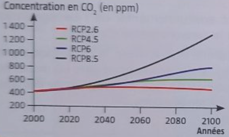
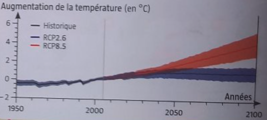
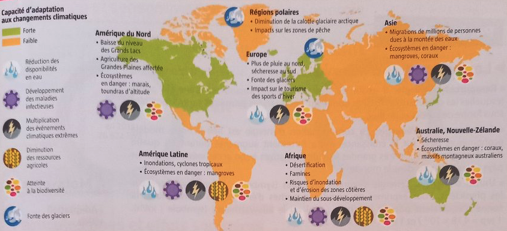

# Le GIEC

\pause{}

Groupe l'experts Intergouvernemental sur l'Évolution du Climat

\pause{}

création : 1988

\pause{}

but : évaluation (sans parti pris) des données sur le changement du climat.

---

# Les scénarios RCP

\pause{}

RCP8.5:   peu de réduction des émissions

\pause{}

RCP6.0:   utilisation de certaines technologies d'atténuation

\pause{}

RCP4.5:   technologies d'atténuation plus efficaces

\pause{}

RCP2.6:   participation de tous les pays, élimination active des émissions de CO2

---

# Les scénarios RCP

---

# Les scénarios RCP

---

# Pourquoi est-ce dangeureux ?

\pause{}

augmentation des températures :

\pause{}

 - moins de photosynthèse
 \pause{}
 - plus d'épisodes de sécheresse

\pause{}

$\implies$ moins de production agricole

---

# Pourquoi est-ce dangeureux ?

---

# Pourquoi est-ce dangeureux ? -- Types de dangers dans le monde

---

# Pourquoi est-ce dangeureux ? -- Exemple du Nicaragua

\pause{}

Nicaragua : economie basé sur le café : 
 \pause{}
 - 30% de l'emploi
 \pause{}
 - 20% des revenus d'exportations

\pause{}

---

# Pourquoi est-ce dangeureux ? -- Exemple du Nicaragua
\pause{}

### Enjeux

\pause{}

##### Impacts climatiques :

\pause{}

 - sécheresse
 \pause{}
 - Perte de la canopée \pause{} $\implies$ \pause{} perte des zones d'ombrage essentielles aux caféiers

---

# Pourquoi est-ce dangeureux ? -- Exemple du Nicaragua
\pause{}

### Risques

\pause{}

##### Impacts économiques :
\pause{}

 - baisse de la production / qualité des grains de café
\pause{}

##### Impacts sociaux :
\pause{}

 - sécurité alimentaire (revenus) des producteurs
 - pauvreté \pause{} $\Longleftarrow$ \pause{} baisse du prix du café

---

# Pourquoi est-ce dangeureux ? -- Exemple du Nicaragua
\pause{}

### Mesures d'adaptation :

\pause{}

 - modifier leurs pratiques
 \pause{}
 - migrer leurs productions (en altitude)
 \pause{}

###### Exemples de mesures :
\pause{}

   * diversification des productions
   \pause{}
   * variétés plus résistantes
   \pause{}
   * aménagements de systèmes d'irrigation / de couvert végétal
   \pause{}

---

# Conclusion

\pause{}

 - Les pays les plus pauvres sont les plus en danger
 \pause{}
 - L'Europe et les Etats-Unis sont peu en danger
 \pause{}
 - Les organisations internationnales ont du mal à faire changer les choses
 \pause{}
 - Si les gouvernements n'agissent pas **tous**, **rapidement** et **efficacement**, le changement climatique est inévitable.
 \pause{}
 - Puisque les gouvernements ne semblent pas agir suffisemment, il faudra trouver des solutions pour nous adapter (comme c'est déjà le cas au Nicaragua)
 \pause{}

Le film _Demain_ tente d'apporter des solutions concrètes à ces problèmes.

---

\begin{center}
\huge
Merci pour votre écoute !
\end{center}

